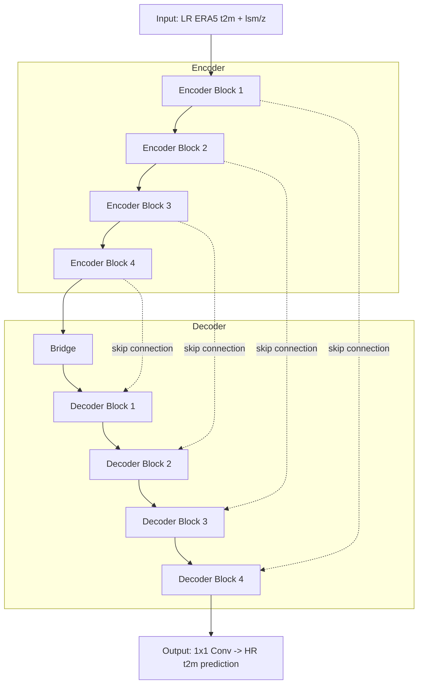

# Temperature-Based Downscaling with U-Net and Standardized Anomalies

This repository contains the implementation for my bachelor's thesis project, focusing on temperature-based downscaling using a U-Net model in combination with standardized anomalies. The project is developed entirely in Python.

## Overview

The objective of this research is to implement a downscaling technique that utilizes the power of U-Net, a convolutional neural network model known for its effectiveness in image segmentation, and leverages standardized anomalies to enhance the downscaling process.

## Architecture

The model is a standard U-Net encoder-decoder: 4 encoder blocks (each with two convolutional layers followed by max pooling) reduce the spatial resolution while extracting features from the low-resolution ERA5 input; a bridge block connects encoder and decoder; 4 decoder blocks upsample back to the target resolution via transposed convolutions, each concatenated with the matching encoder block's feature map through a skip connection so fine spatial detail from the input isn't lost during downsampling.



## Repository Structure

The repository is organized into several main directories, each serving a specific purpose:

### `downscaling`
Contains scripts related to the downscaling process:
- **`modelconfig`**: Configuration for model parameters such as optimizers and learning rates.
- **`pipeline`**: Implements the downscaling pipeline.
- **`unet`**: Contains the architecture of the U-Net model used for downscaling.
- **`utility`**: Utility functions used in the downscaling process.

### `data_operations`
Includes scripts for data manipulation and handling:
- **`data generator`**: Generates batches of data for model training and validation.
- **`data loader`**: Loads data into the system.
- **`utility`**: General-purpose utility functions related to data operations.

### `evaluation`
Scripts for evaluating model performance and visualizing results:
- **`metrics`**: Implementation of evaluation metrics such as RMSE and MAE.
- **`visualizer`**: Tools for visualizing evaluation results, including histograms and difference maps.

### `preprocessor`
Contains preprocessing scripts for data normalization:
- **`standardized anomalies`**: Implements standardized anomaly normalization for preprocessing data.
- **`min max`**: Provides a baseline for comparison using min-max normalization.
- **`utility`**: Utility functions for preprocessing operations.

### `visualization`
Scripts related to data visualization and presentation:
- **`spatial area`**: Tools for visualizing data within a specific spatial area.
- **`climate data`**: Visualization scripts tailored to climate data representation.

### `experiments`
Jupyter notebooks documenting experiments conducted with different datasets and data processing techniques, including experiments spanning 4 years and 10 years.

### `data`
Please note that the data associated with this project is not stored within this GitHub repository due to its size. Instead, the data will be loaded and pre-processed dynamically within the Jupyter Notebook scripts provided. 

## Results

Best result so far, using standardized anomalies normalization on the 4-year, spatially cropped dataset:

| Setting | Value |
|---|---|
| Normalization | Standardized anomalies |
| Filters | 896 → 448 → 224 → 112 → 56 |
| Activation | tanh |
| Loss | Huber loss |
| LR scheduler | Time decay |
| Epochs / Batch size | 15 / 4 |

| Metric | Value |
|---|---|
| RMSE | 8.55 K (14.60% of true value range) |
| MAE | 7.19 K (12.28% of true value range) |

Full run details (loss curves, evaluation metrics) are saved per run under `results/model_and_results_*.json`; this one is `results/model_and_results_sa_4y_1.json`.

## Requirements

To run the code from this repository, ensure you have the required libraries installed. You can install them using the provided requirements.txt file. To install the necessary libraries, run the following command:

```
pip install -r requirements.txt
```

